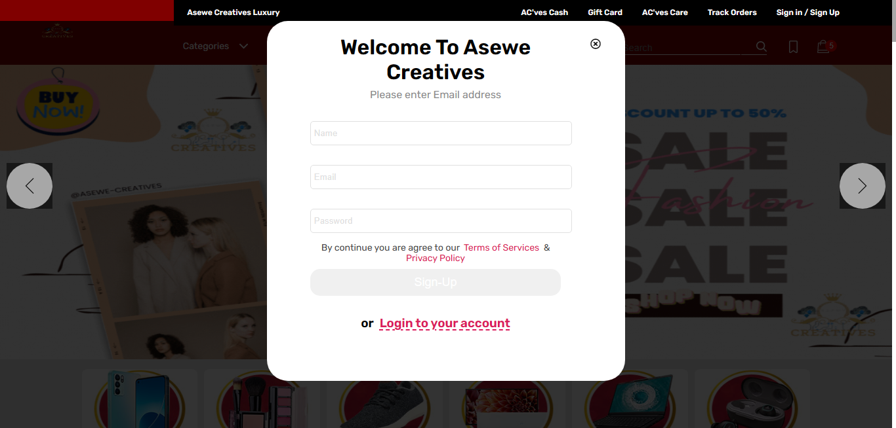
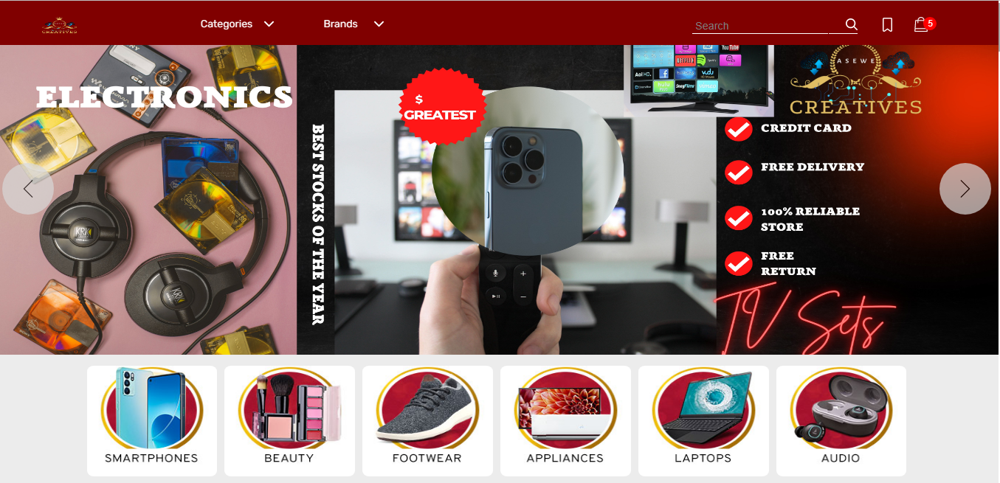
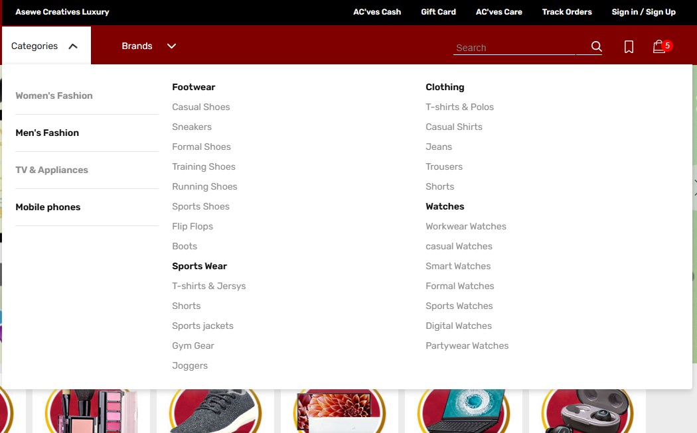
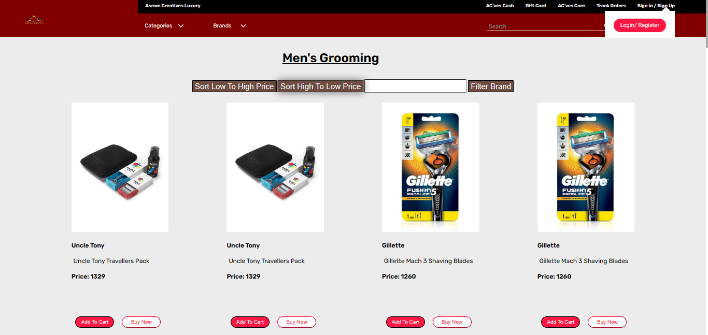
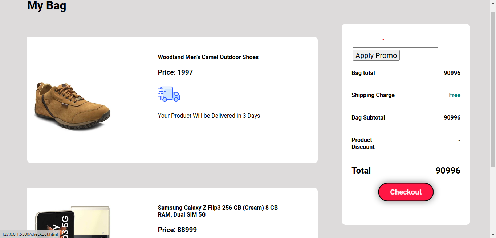
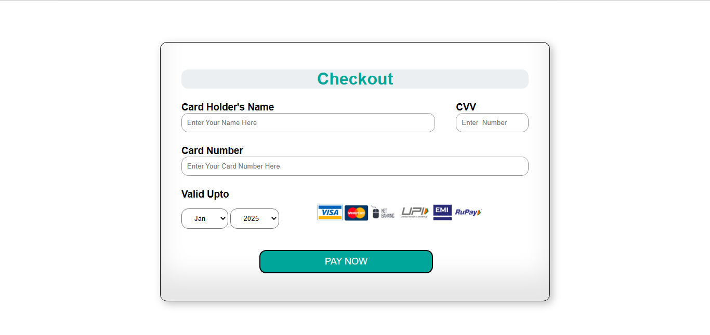

# AseweCre
E-commerce Website for Buying Different Products.

Figma Design & Prototype link....(https://www.figma.com/file/SYKATs2Bhy916PLLW0ok0P/ASEWECRE-E-COMMERCE-WEBSITE?node-id=0%3A1&t=rTITZPAIlMQDInIe-1)
# PREVIEW    

<h1>Register/Login Float.</h1>

 
<h1>Top Homepage.</h1>

 
<h1>Categories.</h1>

 
<h1>Products.</h1>

 
<h1>ORDER-CART.</h1>

 
<h1>Checkout Page.</h1>

 
 

# Features
You will be able to create your account using login and signup option, used API calls for validating user credentials.

Used Reusable Components in landing page such that it can be reused in any other pages easily without repeatation.

You can choose a product which you want to buy and add to cart section.

One can Sort and Filter the product according to the gender and brand of different products.

User can also select and remove items from cart section and make payment through card.

All the data is stored in the localStorage of the User.

# Instructions to Run the Code