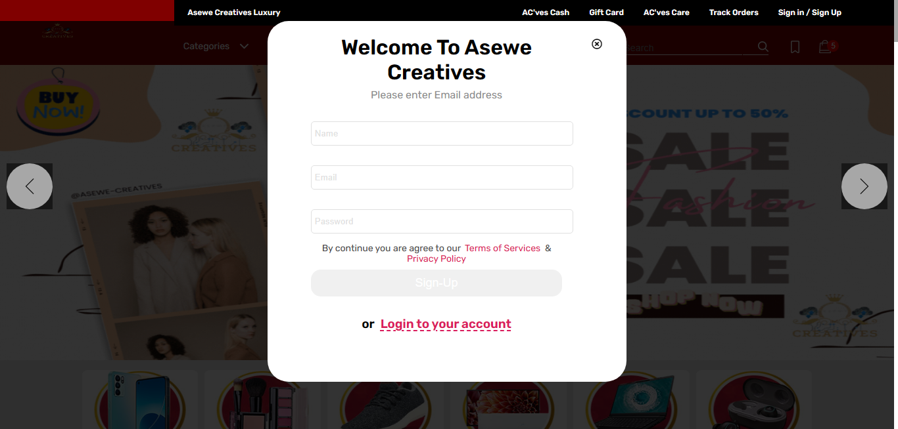
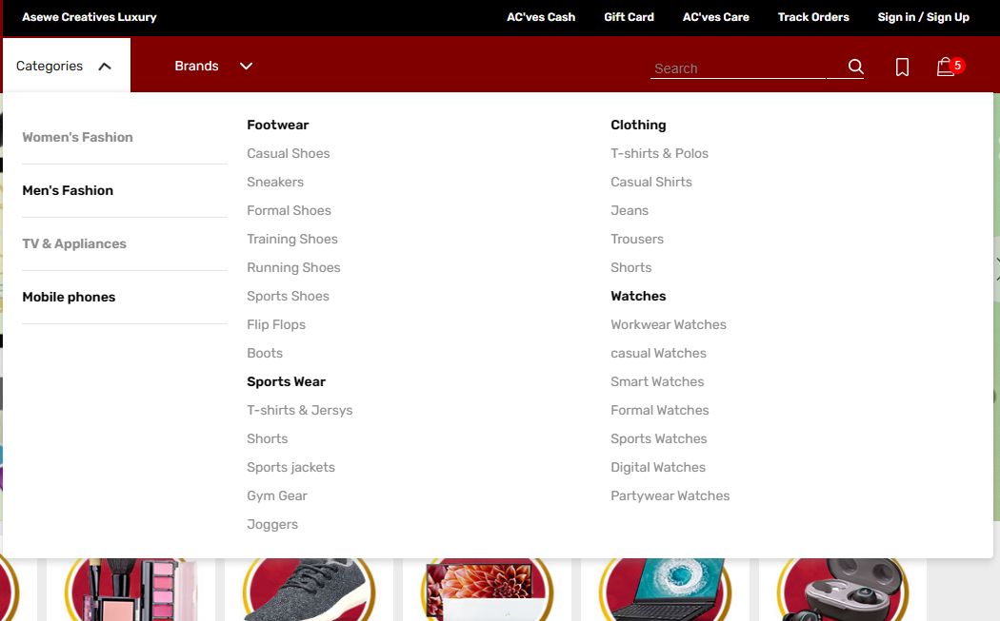
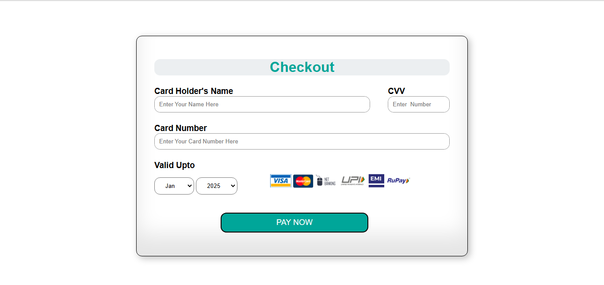

# AseweCre
E-commerce Website for Buying Different Products.

*Find attached is the project  <a href="https://www.canva.com/design/DAFehz0onAM/oY8gruAz7-5tYOSgN1p95Q/view?utm_content=DAFehz0onAM&utm_campaign=designshare&utm_medium=link&utm_source=publishsharelink">Documentation</a>  file.

Figma Design & Prototype link....(https://www.figma.com/file/SYKATs2Bhy916PLLW0ok0P/ASEWECRE-E-COMMERCE-WEBSITE?node-id=0%3A1&t=rTITZPAIlMQDInIe-1)
# PREVIEW    

<h1>Register/Login Float.</h1>

 
<h1>Top Homepage.</h1>

 
<h1>Categories.</h1>

 
<h1>Products.</h1>

 
<h1>ORDER-CART.</h1>

 
<h1>Checkout Page.</h1>

 
 

# Features
You will be able to create your account using login and signup option, used firebase authentication to validate user credentials.

Used Reusable Components in landing page such that it can be reused in any other pages easily without repetition.

You can choose a product which you want to buy and add to cart section.

One can Sort and Filter the product according to the gender and brand of different products.

User can also select and remove items from cart section and make payment through card.

All the data is stored in the localStorage of the User.e.t.c.

# PROJECT PLAN/ DOCUMENTATION.

<h1>BUSINESS NEEDS.</h1>
<h2>Background Story.</h2>
As a customer, have you ever been frustrated? Well, regrets?  Not once, not twice have I suffered in the hands of online vendors/distributors. Why? Some of the online products are fake and cannot be verified whether by brand or originality with poor description. It’s also hard to checkout and monitor the products once a delivery has been initiated. 
Many e-commerce websites deals with particular products leaving customers to search for multiple websites. The world has grown, the goal is to empower entrepreneurs and small businesses to succeed in the competitive world of e-commerce.

<h2>Problem Statement.</h2>
Despite the growth in online marketing and shipping, when it comes to quality and affordability, the results are not pleasing. Lack of transparency has led to distrust and frustrations with some of the shopping experience.
Many e-commerce websites have limited product selection, customers are tired of checking out many websites with particular single products and they only end up with products that doesn’t meet their expectations.

<h2>Solution.</h2>
With a key theme, “save time save money, no frustrations, “not selling but building relationships. 
Here is to provide a reliable online shopping experience, offering wide collection and varieties. Good quality and trust being our core-driving values.

<h2>Market Target.</h2>
The main target is tech-savvy audience with the following features:
	One-stop customers. No waste of time in browsing multiple websites.
	High quality go-getters.
	Value transparency.
	Busy professionals/students.
	Loyal customer base.

<h2>Business Logic.</h2>
	Product sales.
	Advertising i.e. Banner ads, sponsored content etc.
	Affiliate marketing, i.e. Commissions.
	Loyal Customer base.
	Competitiveness.
The goal is to enable sustainable and profitable business.

- The website is an expanded idea and design practice borrowed from Tata Cliq website.//
